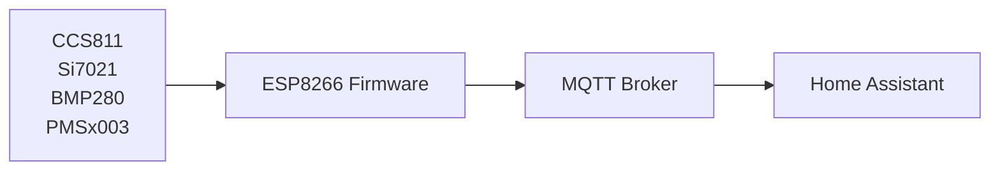

# 🌫 ESP8266 Air Quality Sensor

DIY **ESP8266-based air quality monitoring station** with **MQTT** and automatic **Home Assistant discovery**.

[]()
[]()
[]()
[]()

---

# 📸 Device

<p align="center">

</p>

*(Add your device photo to `docs/device.jpg`)*

---

# ✨ Features

* 📡 **MQTT integration**
* 🏠 **Automatic Home Assistant discovery**
* 🌡 Multi-sensor environmental monitoring
* 🔬 Air quality monitoring (CO₂, VOC, PM particles)
* ⚡ Lightweight firmware for ESP8266
* 🔒 Credentials stored outside the repository

---

# 📊 Measured Parameters

| Sensor      | Parameter                        |
| ----------- | -------------------------------- |
| **CCS811**  | CO₂ (ppm), TVOC (ppb)            |
| **Si7021**  | Temperature (°C), Humidity (%)   |
| **BMP280**  | Temperature (°C), Pressure (hPa) |
| **PMSx003** | PM1.0, PM2.5, PM10 (µg/m³)       |

---

# 🧠 System Architecture



---

# 🔌 Hardware

### Controller

* ESP8266 (NodeMCU / Wemos D1 Mini)

### Sensors

* CCS811 (air quality)
* Si7021 (temperature & humidity)
* BMP280 (pressure)
* PMSx003 (particulate matter)

---

# 🔧 Wiring

### I2C Sensors

| ESP8266 | Sensor |
| ------- | ------ |
| GPIO2   | SDA    |
| GPIO14  | SCL    |

Connected devices:

* CCS811
* Si7021
* BMP280

---

### PMS Sensor (UART)

| ESP8266 | PMS |
| ------- | --- |
| GPIO12  | RX  |
| GPIO13  | TX  |

Baud rate:

```
9600
```

---

# 📡 MQTT Topics

Base topic:

```
air_quality/<device_id>/
```

Examples:

```
air_quality/12345678/co2
air_quality/12345678/tvoc
air_quality/12345678/temperature
air_quality/12345678/humidity
air_quality/12345678/pressure
air_quality/12345678/pm1_0
air_quality/12345678/pm2_5
air_quality/12345678/pm10
```

Device availability:

```
air_quality/<device_id>/availability
```

---

# 🏠 Home Assistant Integration

The device uses **MQTT Discovery**, so sensors are automatically created.

Steps:

1. Install MQTT integration in Home Assistant

```
Settings → Devices & Services → MQTT
```

2. Start the ESP8266 device

3. Sensors appear automatically.

---

# 🔐 Configuration

Credentials are stored in:

```
secrets.h
```

This file is **excluded from Git**.

Create it from the template:

```
secrets.example.h
```

Example:

```cpp
#pragma once

#define WIFI_SSID "YOUR_WIFI"
#define WIFI_PASS "YOUR_PASSWORD"

#define MQTT_HOST "192.168.1.10"
#define MQTT_PORT 1883

#define MQTT_USER "mqtt_user"
#define MQTT_PASS "mqtt_password"
```

---

# 📦 Installation

### 1️⃣ Clone repository

```
git clone https://github.com/YOUR_USERNAME/esp8266-air-quality.git
```

---

### 2️⃣ Create credentials file

```
cp secrets.example.h secrets.h
```

Edit credentials.

---

### 3️⃣ Install Arduino libraries

Required libraries:

* PubSubClient
* SparkFun CCS811
* SparkFun Si7021
* Adafruit BMP280
* PMS Library

---

### 4️⃣ Flash firmware

Upload sketch to ESP8266 using Arduino IDE.

---

# ⏱ Measurement Interval

Default publish interval:

```cpp
const unsigned long PUBLISH_INTERVAL_MS = 60000;
```

(1 minute)

---

# 📟 Example Serial Output

```
WiFi connected, IP: 192.168.88.27
MQTT connecting as air_quality_0023E504

CCS811: CO2=430 ppm, TVOC=5 ppb
Si7021: T=23.4 C, RH=32.7 %
BMP280: T=23.2 C, P=1002.6 hPa
PMS: PM1=23, PM2.5=30, PM10=30
```

---

# 📁 Project Structure

```
esp8266-air-quality/
│
├── sketch_air_quality.ino
├── secrets.example.h
├── .gitignore
├── README.md
│
└── docs/
    └── device.jpg
```

---

# 🚀 Future Improvements

* OTA firmware update
* Web configuration interface
* Deep sleep power mode
* Sensor calibration
* Migration to ESP32

---

# 📜 License

MIT License

---

# 👨‍💻 Author

DIY air quality monitoring project for **Home Assistant** and **MQTT based smart home systems**.
